# Language-Conditioned Affordance-Based Grasp Pose Learning from 3D Point Clouds for Robotic Skill Generalization

Robotic manipulation in unstructured environments needs both semantic understanding of object affordances and task-specific 6-DoF grasp poses from natural-language instructions. Given a 3D point cloud and a task description, the system detects open-vocabulary affordance regions and generates corresponding grasps.

The work covers two tracks:

1. **Designed architecture** — a unified diffusion formulation with a **Context Block** (PointNeXt + OpenCLIP + local cross-attention), **Affordance Net**, and **Pose Net** , implemented under [`affordance_and_pose_with_dpm/`](affordance_and_pose_with_dpm/).
2. **3DAPNet baseline** — [Nguyen et al., ICRA 2024](https://arxiv.org/abs/2309.10911) in [`models/`](models/), reproduced and deployed in **PyBullet** and on a **Franka** robot with an **Intel RealSense** camera via the ROS 2 packages `franka_*`. Sim/real demos and the qualitative result galleries below use this baseline.

Qualitative 3DAPNet results show that affordance predictions on complete test point clouds are cleaner than on self-occluded PyBullet views, and highlight the need for stronger models under real-world noise and occlusion.

<p align="center">
  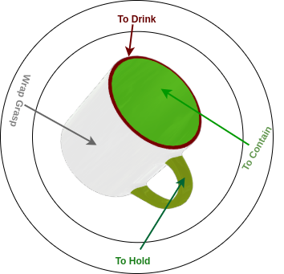
</p>

<p align="center">
  <em>Figure: Same object, multiple affordances — the grasp depends on the language-specified task.</em>
</p>

---

## Problem

Learn a joint distribution over affordance labels A and grasp poses G given geometry–language context (report Sec. III):

```text
(A0, G0) ~ p(A0, G0 | Context)
Context = { point cloud features, task description embedding }

p(A0, G0 | Context) = p(A0 | Context) * p(G0 | A0, Context)
```

The **designed** model (Sec. V) follows this factorization: binary mask A via Bernoulli diffusion and 6-DoF pose G via Gaussian diffusion, with Pose Net conditioned on the affordance mask. The **3DAPNet** baseline (Sec. IV) instead scores affordances with a point–text softmax likelihood and generates poses with classifier-free guided Gaussian diffusion.

---

## Method: Designed Architecture

Multi-modal design: **OpenCLIP** encodes the task text; **PointNeXt** extracts per-point geometry features. Local cross-attention aligns them into a shared context used by separate affordance and pose denoisers.

<p align="center">
  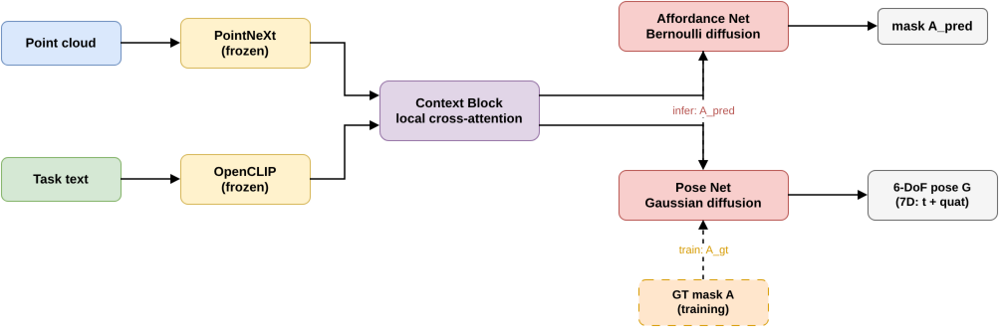
</p>

<p align="center">
  <em>Designed architecture pipeline. Pose Net is mask-conditioned: <strong>training</strong> uses ground-truth affordance <code>A_gt</code>; <strong>inference</strong> uses Affordance Net prediction <code>A_pred</code>.</em>
</p>

### Context Block

Frozen PointNeXt and OpenCLIP feed a learnable local cross-attention module that produces per-point text-aligned features. Early layers group by spatial proximity; the bottleneck groups by feature similarity. A segmentation head is used while training the alignment module.

<p align="center">
  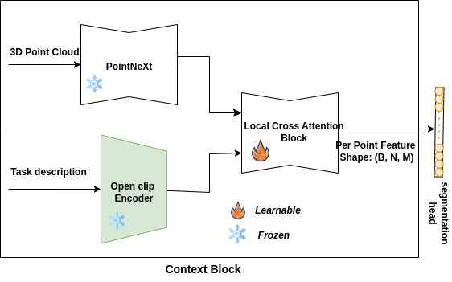
</p>

<p align="center">
  <em>Context Block — frozen encoders, learnable local cross-attention, optional segmentation head.</em>
</p>

Two fusion strategies were compared on the 3DAP dataset:

| Token-wise fusion | Pooled fusion |
|:---:|:---:|
| 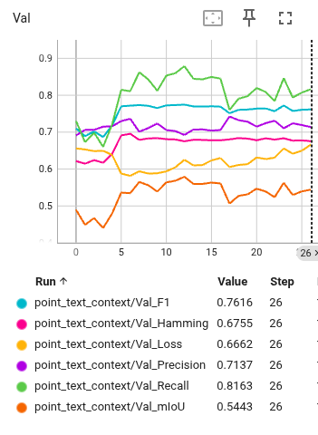 | 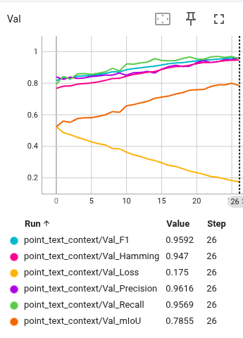 |
| Align each token embedding with point features | Align a single pooled text embedding |
| Lower validation mIoU / F1 | Stronger validation metrics (mIoU ≈ 0.79) |

Pooled fusion outperforms token-wise fusion, likely because task descriptions in 3DAP are short.

### Affordance Net

PointNeXt-inspired U-Net that denoises a per-point affordance mask. Training starts from a Bernoulli sample (p = 0.5) fused with context features; the diffusion timestep is injected with adaptive layer normalization / FiLM. Three Set Abstraction (SA) blocks (FPS, KNN, FiLM, inverted residual) are followed by three Feature Propagation (FP) blocks and a projection to per-point logits. Affordance is trained as a **Bernoulli diffusion** process.

<p align="center">
  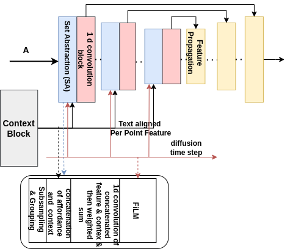
</p>

<p align="center">
  <em>Affordance Net — hierarchical SA/FP with FiLM timestep conditioning.</em>
</p>

### Pose Net

Generates a **6-DoF pose (7D: translation + quaternion)** by attending to local geometry around high-affordance regions. Adaptive anchor sampling prefers dense affordance areas; each anchor gathers a KNN patch encoded with an **EGNN**-style module. Local attention and a global summary token are FiLM-modulated by the diffusion timestep. Pose is trained as a **Gaussian diffusion** process.

<p align="center">
  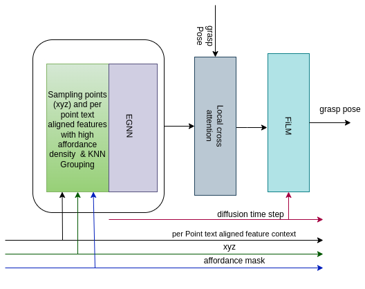
</p>

<p align="center">
  <em>Pose Net — high-affordance anchors, EGNN patches, local attention, FiLM, 6-DoF pose (7D).</em>
</p>

Implementation of this track lives under [`affordance_and_pose_with_dpm/`](affordance_and_pose_with_dpm/).

---

## Baseline: 3DAPNet and ROS Deployment

**3DAPNet** links PointNet++ point features with OpenCLIP text via cosine similarity and softmax affordance scores, and generates poses with classifier-free guided diffusion. It is used as the reference model for sim-to-real qualitative demos in this repository.

<p align="center">
  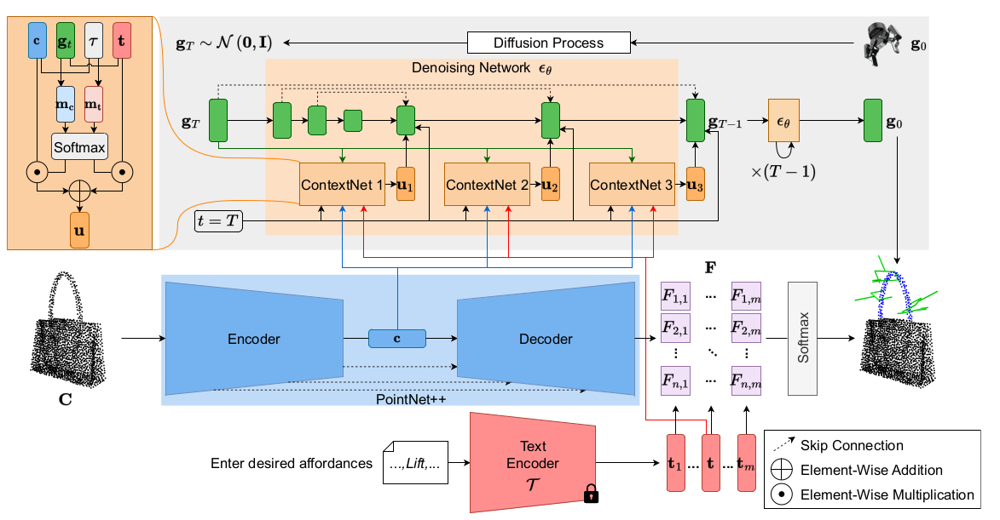
</p>

<p align="center">
  <em>3DAPNet (ICRA 2024) — baseline language-conditioned affordance–pose network.</em>
</p>

### Experimental setup

- **Simulation:** PyBullet + ROS 2, Franka Panda with parallel gripper; tabletop objects; RGB, depth, and segmentation from a sim camera (wrist or top-down). Depth is back-projected to a camera-frame point cloud.
- **Real hardware:** Intel RealSense RGB-D; Detectron2 instance masks isolate the object; masked depth → object point cloud; Franka Research 3.
- **Middleware:** ROS 2 Humble packages `franka_sim`, `franka_real`, and `franka_common` (inference, visualization, pose summarization).

---

## Results

Qualitative galleries below are from **3DAPNet** (report Sec. VII), the same baseline used in the ROS sim/real demos—not from the designed Context / Affordance / Pose nets.

**Legend:** blue — object geometry / affordance emphasis; green — predicted grasp frame or approach axis.

Findings aligned with the thesis (Sec. VII):

- Affordance detection on the curated 3DAP test set is qualitatively better than on self-occluded PyBullet point clouds (incomplete sim clouds hurt the affordance map).
- Generated poses on the PyBullet simulation data are more accurate than poses on the 3DAP test set; poses do not always align with the predicted affordance and task text.
- On a real RealSense scene, the system detects affordances and provides corresponding poses.

| Wrap grasp | Pick |
|:---:|:---:|
| 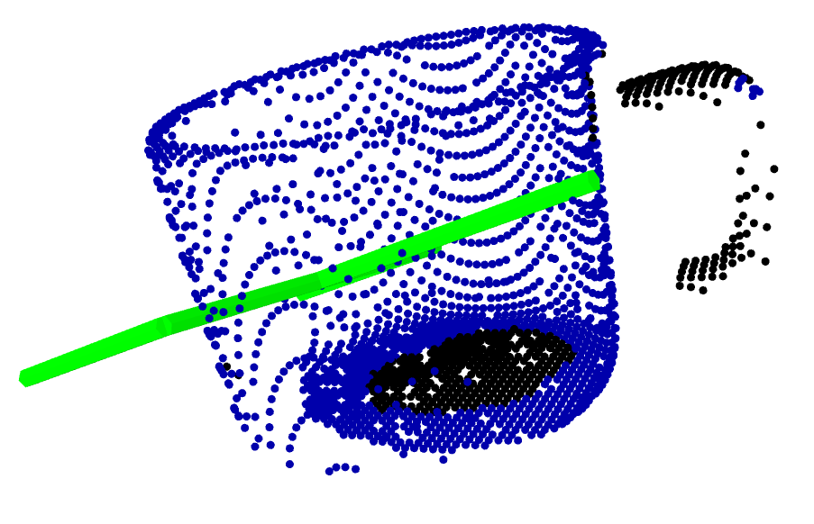 | 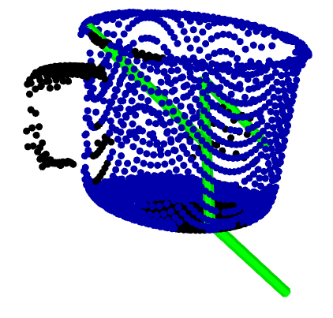 |
| **Lift** | **Contain** |
| 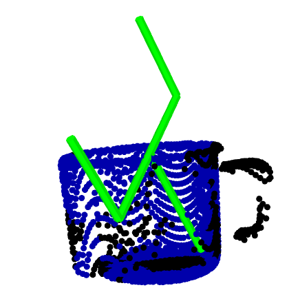 | 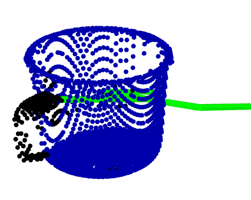 |

---

## Repository layout

```text
affordance-based-grasp-pose/
├── affordance_and_pose_with_dpm/   # Context Block, Affordance Net, Pose Net (DPM)
├── models/                         # 3DAPNet (adapted) used in ROS demos
├── franka_common/                  # Model node, affordance/pose visualization
├── franka_sim/                     # PyBullet Franka + point-cloud publisher
├── franka_real/                    # RealSense camera node
├── custom_interfaces/              # Camera / Object / Robot messages
└── images/                         # Figures used in this README
```

---

## Quick start

### Prerequisites

- Ubuntu 22.04 LTS
- ROS 2 Humble
- Python 3.10+
- NVIDIA GPU + CUDA (recommended)

### Installation

```bash
# 1. Workspace and clone
mkdir -p ~/ros2_ws/src && cd ~/ros2_ws/src
git clone https://github.com/mfarhadhussain/affordance-based-grasp-pose.git
cd affordance-based-grasp-pose && git submodule update --init --recursive

# 2. Dependencies
cd ~/ros2_ws
rosdep install --from-paths src --ignore-src -r -y
pip install -r src/affordance-based-grasp-pose/requirements.txt
pip install torch torchvision torchaudio --index-url https://download.pytorch.org/whl/cu118

# 3. Build
colcon build --symlink-install
source install/setup.bash
```

### Simulation

The ROS nodes below run the **3DAPNet** baseline (via `franka_common`), not the designed DPM stack.

```bash
# Terminal 1 — Franka + scene in PyBullet
ros2 launch franka_sim franka_sim.launch.py

# Terminal 2 — language-conditioned affordance + pose model
ros2 run franka_common model_node --ros-args --param task_description:="grasp to lift"

# Terminal 3 — visualize affordance and grasp frame
ros2 run franka_common affordance_pose_plot_node
```

Example task strings: `grasp to lift`, `grasp to pour`, `grasp to pick`, `wrap grasp`, `grasp to contain`.

### Real robot

Same **3DAPNet** inference path as simulation.

```bash
# Terminal 1 — RealSense RGB-D → point cloud
ros2 run franka_real franka_real_cam_node

# Terminal 2 — inference
ros2 run franka_common model_node --ros-args --param task_description:="grasp to pour"
```

---

## Citation

```bibtex
@thesis{hussain2025affordance,
  title   = {Language-Conditioned Affordance-Based Grasp Pose Learning from 3D Point Clouds for Robotic Skill Generalization},
  author  = {Hussain, Md Farhad and Prakash, Ravi},
  school  = {Robert Bosch Centre for Cyber-Physical Systems, Indian Institute of Science, Bengaluru},
  year    = {2025}
}

@inproceedings{Nguyen2024language,
  title     = {Language-Conditioned Affordance-Pose Detection in 3D Point Clouds},
  author    = {Nguyen, Toan and Vu, Minh Nhat and Huang, Baoru and Van Vo, Tuan and Truong, Vy and Le, Ngan and Vo, Thieu and Le, Bac and Nguyen, Anh},
  booktitle = {ICRA},
  year      = {2024}
}
```

## Acknowledgements

- [3DAPNet](https://github.com/Fsoft-AIC/Language-Conditioned-Affordance-Pose-Detection-in-3D-Point-Clouds) — language-conditioned affordance–pose detection
- [PointNeXt](https://github.com/guochengqian/PointNeXt) — point-cloud backbone in the designed architecture
- [Detectron2](https://github.com/facebookresearch/detectron2) and [pybullet-URDF-models](https://github.com/ChenEating716/pybullet-URDF-models) — real-scene segmentation and simulation assets
